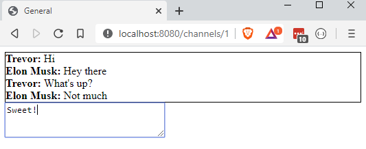

Assignment #14

Chat Application

Your goal for this assignment will be to build an interacting chat application that allows multiple users to talk with each other via chat text messages. This will be just like a simple version of Slack.

To get started, visit start.spring.io and create a Java 11 Spring Boot application with Spring Web + Thymeleaf dependencies.

For this assignment, it is not required to implement a MySQL database as a repository for all the data. You can just store any data inside of Java Collections (within concrete Repository classes).

The UI for this application is going to be simple and will consist of two HTML files:

1.       A Welcome page where a user will be prompted to enter their name (if not already specified), and a list of Channels will be shown for them to “join” and chat with others

2.       A Channel page where the actual chats will take place. Note that there can be multiple channels, and messages sent inside of each channel should only be displayed in their respective channels (just like Slack channels)

Here's what a channel looks like with two people chatting back and forth:

Use Cases

When a new user visits any pages

The new user will be redirected to the Welcome page and prompted for their name. Once a name is entered, a User object will be created (with a unique ID) and this user will be stored in the sessionStorage area of the browser, as well as on the Server side in a UserRepository

When an existing user visits the welcome page

The existing user will be able to choose from a list of Channels that they can join. When they click on an existing channel link, they will be directed to the URL structure /channels/{channelId}

When a new user visits a channel page

Since this is a new user and has not yet been stored in sessionStorage (nor Java UserRepository storage), they will be redirected to the welcome page

When an existing user visits a channel page

The existing user will be able to start entering chat messages into a textarea element. When the user hits the “Enter” key on the keyboard, it should send the message to the server side and store it into the MessageRepository.

The channel page should also continually “poll” for messages. This means that every 500 milliseconds the JavaScript code should ask the Java server for a list of all messages to be displayed for the existing user inside of the specific channel. Remember, don’t show messages that don’t belong to the current channel the user is watching.